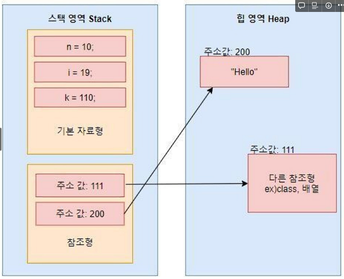

> JAVA 자료형 (기본형, 참조형) 차이점

# 간단 정리

- 기본형 타입(Primitive type) :  논리형(boolean), 문자형(char), 정수형(byte, short, int, long), 실수형(float, double) 등의 실제 데이터값을 stack 메모리에 저장하는 타입
- 참조형 타입(Reference type) : 기본형 타입을 제외한 모든 타입을 의미합니다. 객체, 클래스, 배열, 열거형, 인터페이스 등등을 의미하며 메모리 heap영역에 실제 값이 저장되고 힙영역 주소값을 메모리 stack영역에 저장하는 타입

# 필요한 사전 지식

## 자바의 메모리 영역

자바 프로그램이 실행되면 JVM은 OS로부터 메모리를 할당 받고, 메모리를 용도에 따라서 여러 영역으로 나누어 관리합니다.

JVM의 메모리 공간은 크게  **Stack 영역, Heap 영역, Method 영역**으로 구분됩니다.

### Stack 영역

- **기본형 타입의 데이터에 해당되는 지역 변수, 매개 변수 데이터 값이 저장**됩니다.
- **Heap 영역에 있는 객체들을 가리키는 주소값을 저장**합니다.
- 메소드 내에서 정의하는 기본 자료형에 해당되는 지역변수의 데이터 값이 저장되는 공간
- 메소드가 호출될 때 스택 영역에 스택 프레임이 생깁니다.
- 메소드가 호출 될 때 메모리에 할당 되고 종료되면 메모리에서 사라집니다.
- LIFO 특성을 갖고 스코프(Scope)의 범위를 벗어나면 스택 메모리에서 사라집니다.

### Heap 영역

- **참조형 타입의 데이터를 갖는 인스턴스(객체) 등이 저장 되는 공간** 입니다.
- Heap 영역은 Stack 영역과 다르게 보관되는 **메모리가 호출이 끝나더라도 삭제되지 않고 유지** 됩니다. 그러다 어떤 참조 변수도 Heap 영역에 있는 인스턴스를 참조하지 않게 된다면, GC(가비지 컬렉터)에 의해 메모리에서 청소됩니다.
- JVM이 관리하는 프로그램 상에서 데이터를 저장하기 위해 런타임 시 동적으로 할당하여 사용하는 영역입니다.

## 변수

- 변수는 데이터를 담는 그릇이며, 프로그램에 할당받은 메모리 공간입니다.
- 자바에서 말하는 데이터 타입(자료형)은, 변수에 적재할 데이터가 메모리에 어떻게 저장되고 프로그램에서 어떻게 처리되어야 하는지를 명시적으로 알려주는 키워드입니다.
- 데이터 타입(자료형)은 기본형 타입과 참조형 타입으로 구분됩니다.
- 기본형 타입의 변수에는 데이터 자체를 저장합니다.
- 참조형 타입의 변수에는 데이터를 담고 있는 Heap 영역의 메모리 주소를 저장합니다.

# 기본형 타입(Primitive Type)

### 기본형 타입이란?

Primitive는 ‘원시적인’이라는 사전적인 의미를 갖습니다.
이것을 프로그래밍적으로 생각해본다면, 데이터 그 자체로 해석해도 좋을것 같습니다.

기본형 타입 변수의 종류는 논리형(boolean), 문자형(char), 정수형(byte, short, int, long), 실수형(float, double) 등이 있으며, 실제 데이터값을 stack 메모리에 저장하는 타입입니다.

### **특징 정리**

1. 메모리 **스택** **영역**에 **값 자체를 저장**합니다.
2. 비객체 타입이므로 null 값을 가질 수 없고 기본값이 정해져 있습니다.
3. 복사는 깊은 복사만 존재합니다.
4. 기본형 타입도 실행되면

# 참조형 타입(Reference Type)

### 참조형 타입이란?

Reference는 ‘참고’, ‘참조’라는 사전적인 의미를 갖습니다.

이것은 사전적인 의미 그대로 어떤 값을 참조 한다 라고 생각이 듭니다.

어떤 것을 참조 한다는 것일까요?

참조형 타입의 종류로는 기본형 타입을 제외한 나머지를 의미 하며 클래스, 배열, 열거형, 인터페이스 등등 존재 합니다. (기본형 타입의 래퍼 클래스는 참조형 타입)

또한, 기본형 타입의 데이터 보다는 참조형 타입의 데이터가 방대한 데이터를 갖고 있어서 이러한 방대한 데이터를 스택 영역에서 다루기에는 무리가 있기 때문에 참조형 데이터 값 자체를 메모리 힙영역에 저장을 하고 힙영역을 가리키는 주소를 스택 영역에 저장을 하여 사용 하게 됩니다.

이해하는데 쉽게 이미지를 첨부합니다.




### 특징 정리

- 기본형 타입이 실제 값을 저장하는 것과 달리 참조형 타입은 데이터를 담고 있는 Heap 영역의 주소값을 저장합니다.
- 주소를 저장하기 때문에 복사는 깊은 복사 혹은 얕은 복사를 할 수 있습니다.
- 참조형 변수는 null로 초기화 시킬 수 있습니다.


> 리터럴(Literal)
# 리터럴

## 리터럴이란?

리터럴은 데이터 그 자체를 뜻 합니다.

변수에 넣는 변하지 않는 데이터를 의미합니다.

```java
int a = 1;
```

위에서 a는 변수를 뜻하고 1은 리터럴을 의미합니다.

## 리터럴과 상수

상수와 리터럴은 비슷하지만 다른 의미를 갖습니다.

**상수** : 초기화 이후 값이 변하지 않는 수

```java
final int a = 1;
```

**리터럴** : 상수의 일종으로 선언 없이 바로 사용할 수 있는 문자 그대로의 상수를 의미

```java
123
"Hello World!"
true
```