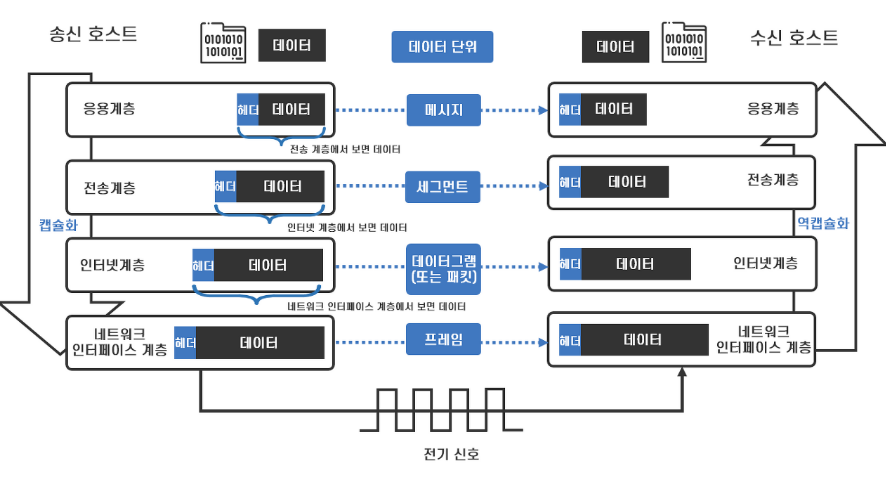
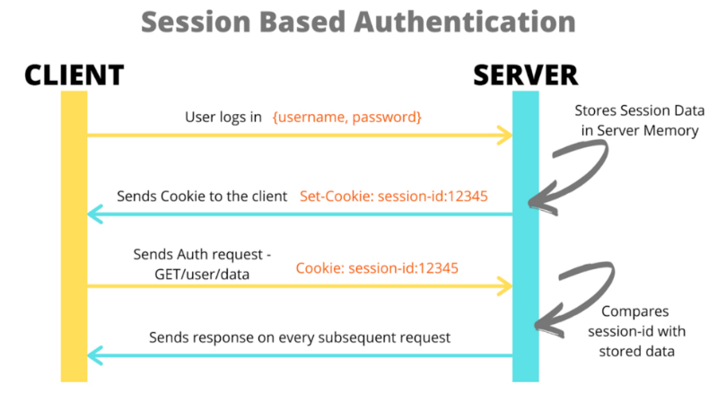

## TCP/IP  && 세션기반 인증, 토큰 기반 인증 

## TCP/IP 프로토콜은 무엇인가요?

인터넷 프로토콜(ip)와 전송 조절 프로토콜(tcp)의 묶음을 의미한다.
두 가지 프로토콜 방식을 조합하여 통신하는 것을 tcp/ip라 한다.

TCP / IP 4계층 

4계층 : 응용 계층  네트워크에 직접 연결된 기기간 전송을 도와준다. MAC 주소 사용.  
프로토콜 EX) ETHERNET, PPP, THOKEN RING  
3계층 : 전송 계층 수신측까지 데이터 전달 송신,수신측 IP 주소를 바탕으로 올바른 목적지를 찾아감.   
프로토콜 EX) IP, ARP, ICMP, RARP, OSPF  
2계층 : 인터넷 계층 송신된 데이터를 수신측APP에 전달  
프로토콜 ex) TCP/ UDP , RTP, RTCP 등  
1계층 : 네트워크 인터페이스 계층   특정 서비스를 제공하기 위해 app 끼리 정보를 주고 받음  
프로토콜 ex) FTP, HTTP, SSH, TELNET, DNS, SMTP  

계층 하나를 거칠때마다 헤더가 하나씩 늘어나는 것을 확인할 수 있다. 
데이터를 수신호스트까지 효율적으로 전송하기 위한 정보들을 담고 있다. 

응용 계층 : 어플리케이션 헤더  
전송 계층 : TCP 헤더 (송신지 포트번호 + 수신지 포트번호)  
인터넷 계층 : IP 헤더 (송신지 IP 주소 + 수신지 IP 주소)   
네트워크 인터페이스 계층 : 이더넷 헤더 (송신지 MAC 주소 + 수신지 MAC주소)  

* (요청시 담는 주요정보)

1. 응용 계층은 TCP/IP를 사용하는 애플리케이션이 사용하는 프로토콜에 필요한 정보를 헤더로 담는다. 
2. 전송 계층은 해당 패킷의 송신지, 수신지 각각의 포트번호 정보를 담게 되어 수신 호스트에 도착햇을때 
   어떤 소켓에 데이터를 갖다줄 지에 대한 정보를 담게 된다. 
3. 인터넷 계층은 해당 패킷의 송신지, 수신지 각각의 IP 주소 정보를 담게 되어 네트워크의 
   모든 라우터들이 이를 참조하여 가장 효율적인 경로로 패킷을 라우팅해주게 된다. 
4. 네트워크 인터페이스 계층은 비교적 물리적인 정보를 담게 된다. 
   송신지 및 수신지의 MAC 주소를 담아 이더넷 카드를 통해 해당 패킷을 내보낸다.

수신 호스트 입장에서 살펴보기 

송신 호스트에서 캡슐화를 한 순서 그대로 역순으로 역캡슐화하면서 올라가보면 된다. 

1. 수신 호스트의 네트워크 인터페이스 계층에 패킷이 도착하게 되면, 이를 인터넷 계층으로 
   올려보낸다. 
2. 인터넷 계층은 해당 패킷의 IP 헤더를 뜯어봤을 때 발신지를 확인하고, 수신지가 자기자신이라면 
   해당 패킷을 전송 계층으로 올려보낸다. 
3. 전송 계층은 해당 패킷의 TCP 헤더를 뜯어봤을 때 발신 및 수신 포트번호를 확인하여 응용계층으로 
   패킷을 올려보낸다. 누락된 메시지가 잇는지 검사하여 만약 누락된게 있다면 재요청한다.
   모든 패킷이 도착했다면, 순서를 정렬하여 원래 데이터 형태로 정립하여 해당 프로세스를 보낼것이다. 
4. 응용계층은 해당 패킷의 애플리케이션 헤더를 뜯어보고 도착한 데이터를 통해 적절한 조치를 취한다.

### 추가 공부할 것들
**+@@ 3 WAY HANDSHAKING , 4 WAY HANDSHAKING, OSI 7 LAYER  등** 

### 참고 
https://www.youtube.com/watch?v=BEK354TRgZ8
   
## 세션 기반 인증과 토큰 기반 인증의 차이에 대해 얘기해주세요.

### 인증과 인가?

- 인증 
 클라이언트를 서버가 알고 있는 서비스 사용자가 맞는지 검증하는 과정   
EX) login  
- 인가  
 인증된 사용자에 대한 자원에 대한 접근 확인 절차   
 -> 해당 사용자가 가능한 권한, 정보가 어디까지 인지?

### 세션기반 인증

1. 사용자의 인증 정보가 서버의 세션 저장소에 저장되는 방식
2. 로그인시 인증정보를 세션에 저장하고 client 에게 sessionId를 발급.
3. 발급된 Session ID는 브라우저에 쿠키 형태로 저장되지만, 인증정보는 서버에 저장되어 있다. 
4. Session Id를 헤더와 함께 전송하여 id에 해당하는 정보가 저장소에 존재한다면, 사용자로 판단한다. 

### 토큰 기반 인증 

1. 로그인시 인증정보를 인코딩하여  client에 발급. 
2. client는 발급받은 토큰을 브라우저의 로컬 스토리지나 쿠키에 저장. 
3. 요청시 토큰을 Authorization 헤더에 실어 보내면 서버는 토큰을 검증하여
   사용자를 인증,인가한다. 

### 세션기반 인증 vs 토큰기반 인증

고려사항 

1. 트래픽  
세션 : cookie 헤더에 세션 ID를 실어 보낸다.  
토큰: 발급시간, 만료시간, USERNAME 등 유저 정보를 담으므로 더 많은 네트워크 트래픽을 사용한다.   

2. 보안  
Client가 서버로 요청을 보낼 때 더 이상 쿠키를 전달하지 x, 쿠키 사용에 의한 취약점이 사라지게 된다.   
=> 토큰 환경의 취약점을 대비해야함.  

3. 확장성  
scale out 확장에 의해 여러 대의 서버를 운용하면서 세션 방식은 세션 불일치 문제를 겪게 된다.  
해결 방법:  skicky session , session clustering, 세션 스토리지 외부 분리  
토큰 기반 인증 방식은 서버가 인증수단을 저장하지 않고,클라이언트가 저장하므로 
세션 불일치 문제에서 자유롭다.  
이는 http 프로토콜의 비상태성을 그대로 가져가며, 높은 확장성을 가질 수 있다. 

설계단계에서 비용과 여러가지 고려사항을 검토하여 선택 할 것. 