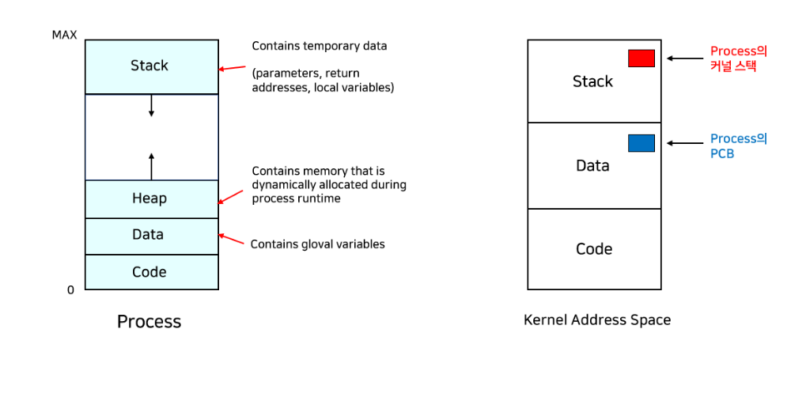

# 프로세스와 스레드의 차이점은 무엇인가요?

## 프로그램과 프로세스 

- 프로그램 : 명령어 코드 및 정적인 데이터의 묶음, 실행되기 전 명령어 
- 프로세스 : 실행중인 프로그램, 운영체제로부터 시스템 자원을 할당받은 작업의 단위 

## 프로세스의 구성 

프로세스의 구성

- TEXT(code)
실행 명령을 포함하는 코드

- data
static 변수 혹은 global 변수
data와 bss로 나뉘는데 초기화된 것과 그렇지 않은 것을 관리한다.  

- heap
동적 메모리 입력

- stack
지역변수, 매개 변수 반환 값 등등 일시적인 데이터

운영체제에서 프로세스를 표현하기위해 사용.
해당 프로세스 정보를 담는 pcb가 생성됨.

+@ PCB 

운영체제가 각 프로세스를 관리하기위해 프로세스별로 보유하고 있는 자신의 정보 묶음.
프로세스 종료시 제거 

구성 정보 
1. PID : 프로세스를 식별하는 ID
2. 프로세스 상태값: CREATE, READY,RUNNING, WAITING, TERMINATED 등
3. 프로그램 계수기(COUNTER):  코드 한 줄을 가리키는 주소 레지스터. 다음에 실행할 
   명령어의 주소를 가리킨다.
4. CPU 레지스터 및 일반 레지스터 
5. CPU 스케쥴링 정보: 우선 순위, 최종 실행시간, CPU 점유 시간 등
6. 메모리 관리 정보: 해당 프로세스의 주소 공간.
7. 프로세스 계정 정보: 페이지 테이블, 스케쥴링 큐 포인터, 소유자 ,부모등 
8. 포인터(STACK POINTER): 부모 프로세스에 대한 포인터, 자식 프로세스에 대한 포인터, 할당된 
   자원에 대한 포인터 정보, 함수 실행시 STACK 최상단 주소 레지스터 

프로세스는 프로그램 계수기와 포인터를 통해 프로세스가 어떤 CODE를 수행하고, 어디 메모리에 
적재할지 구분한다. => PCB에서 관리 

이 두 정보는 PCB에서 가져다 쓰는 것이 아니라 CPU 레지스터에서 관리 
**CONTEXT SWITCHING** 
CPU 레지스터에 있는 프로세스 정보를 PCB에 저장해 두었다가 
RUNNING 상태가 된 다른 프로세스의 PC와 SP를 CPU 레지스터에 적재해서 실행시키기 위함.

## 스레드 

하나의 프로세스 내에서 여러개의 실행 흐름을 두어 작업을 효율적으로 처리하기 위한
모델이다. 

두개 이상의 스레드를 가지는 프로세스를 멀티스레드라 함. 

## 멀티 프로세스 와 멀티 스레드 

멀티 프로세스

- 각 프로세스는 독립적
- ipc를 사용한 통신
- 자원 소모적, 개별 메모리 차지
- context switching 비용이 큼
- 동기화 작업이 필요치 않음.
  EX) 구글 크롬

멀티 스레드

- 스레드끼리 긴밀하게 연결되어 있음
- 공유된 자원으로 통신 비용이 절감.
- 공유된 자원으로 메모리가 효율적임.
- context switching 비용이 적음.
- 공유 자원 관리를 해야함.
- 충돌을 주의 THREAD-SAFE 하게

## 프로세스와 스레드의 차이점. 

공유자원 유무의 차이 
프로세스는 완벽히 독립적이기 때문에 메모리 영역을 공유하지 않지만
스레드는 해당 스레드를 위한 스택영역을 가질뿐 나머지 영역을 공유한다. 

##  정리 

1. 프로세스는 프로그램이 실행된 것이다.
2. 스레드는 한 프로세스 내에서 나뉘어진 하나 이상의 실행단위이다.
3. 한 어플리케이션에 대한 작업을 동시에 하기 위해서는 2가지 처리 방식(멀티 프로세스, 멀티 스레드)가 있다.
4. 동시에 실행이 되는 것처럼 보이기 위해서 실행 단위는 시분할로 cpu를 점유하며 context switching을 한다.
5. 멀티 프로세스는 독립적인 메모리를 가지고 있지만 멀티 스레드는 자원을 공유한다. 그것에 따른 각각의 장단점이 있다.
6. 프로세스에 속한 모든 스레드는 프로세스의 할당된 가상 메모리에 공간이 제약된다.

# 가상 메모리와 페이지 교체에 대해 설명해주세요.

## 가상 메모리 

- 물리 메모리의 한계등을 극복하기 위해 사용한다. 
프로세스 OR 프로그램 전체를 메모리에 올리는 것이 아니라, 필요한 부분만 메모리에 
적재하는 것이다. 적재 여부는 페이지 테이블에 표시된다. 실행될 가능성이 낮은 코드, 행렬 리스트와 같이 
필요한 크기 이상으로 선언된 변수 등은 굳이 적재시키지 않는다.
  
메모리가 꽉차면 어떤 기준으로 페이지를 쫒아내야하는가 => 참조 지역성

- 참조 지역성
동일한 값 또는 해당 값에 관계된 스토리지 위치가 자주 엑세스 되는 특성을 말한다. 가상 메모리 방식이 
효과적임을 뒷받침하는 원리이다. 

1. 공간 지역성: 특정 클러스터의 기억 장소들에 대해 참조가 집중적으로 이루어지는 것. 참조된 메모리 근처의 메모리를 참조
2. 시간 지역성: 최근 사용되었던 장소들이 집중적으로 사용되는 것. 
3. 순차 지역성: 데이터가 순차적으로 엑세스되는 것. 별도의 유형으로 구분하지 않고 공간 지역성에 포함시키기도 한다. 

가상 메모리는 라이브러리가 여러 프로세스끼리 공유 될 수 있도록 지원한다. 
각 프로세스는 공유 라이브러리를 자신의 가상 주소 공간에 두고 사용하는 것으로 인식하지만, 
라이브러리가 올라가 있는 물리 메모리 페이지들은 모든 프로세스에 공유된다. 

## 요구 페이징 기법

가상 메모리 기법은 요구 페이징 기법과 요구 세그멘테이션 기법으로 나뉜다. 

- 요구페이징
필요한 페이지가 생기면 그때 그때 페이지를 메모리로 이동시키는 것이다. 
실제 필요한 페이지만을 적재하기 때문에 페이지 결정에 대한 오버헤드가 최소화 된다.
- 예측 페이징
현재 요구되지는 않지만 곧 사용될 것으로 예측되는 페이지를 미리 옮겨놓는 것이다.

## 페이지 부재 및 교체 

**페이지 부재**는 필요한 페이지가 메모리에 없어 유효-무효 비트가 무효로 설정되어 있는 것을 뜻한다. 
발생시 디스크로부터 페이지를 읽어와야 하는데 해당 과정에서 막대한 오버헤드가 발생한다.
요구 페이징 기법에서 페이지 부재 발생률은 성능에 있어서 큰 비중을 차지한다.
-> page fault 발생 비율을 줄이는 것을 목표 

+@@ page fault : cpu가 프로그램을 실행하면서 필요한 페이지가 물리적 메모리에 없는 경우

만약 필요한 페이지를 적재하는데 메모리가 충분하이 않다면, 메모리에 있는 페이지중 가장 쓸모 없어 보이는 
것을 골라 스왑 영역으로 내보내는 페이지 교체가 일어난다.

-> 페이지 교체 대상이 될 프레임의 범위에 따라 전역 교체와 지역 교체로 나눌 수 있다. 
전역 교체는 모든 페이지 프레임이 교체 대상이 되는것이다.
지역 교체는 현재 수행중인 프로세스에 할당된 프레임 내에서만 페이지 교환을 수행하는 방식이다. 

## 페이지 교체 알고리즘. 

OPT(Optimal) / 최적 알고리즘
각 페이지의 호출 순서를 미리 알고있다는 가정 하에 돌아가는 알고리즘이다. 가장 나중에 호출될 페이지를 내보내는 방식이다. 실제로 구현하기 힘들다.

FIFO(First In First Out)
가장 먼저 올라온 페이지를 가장 먼저 내보내는 알고리즘이다.

LRU(Least Recently Used)
가장 오랫동안 사용하지 않은 페이지를 교체하는 알고리즘이다.

LFU(Least Frequently Used)
참조 횟수가 가장 적은 페이지를 교체하는 알고리즘이다.

NUR(Not Used Recently)
LRU와 비슷한 알고리즘이다. 오랫동안 참조하지 않은 페이지 중 하나를 선택하지만 가장 오래된 페이지라는 보장은 없다.

MFU(Most Frequently User)
LFU와 반대로 참조 횟수가 가장 많은 페이지를 교체하는 알고리즘이다.

+@@@ **스레싱** - 페이지 교체 알고리즘의 문제
메모리가 꽉 찬 후에는 기존 프로그램을 스왑 영역으로 옮겨야 한다. 하드디스크의 입출력이 너무 많아져서 잦은 페이지 부재로 작업이 멈춘 것 같은 상태를 스레싱이라고 한다.