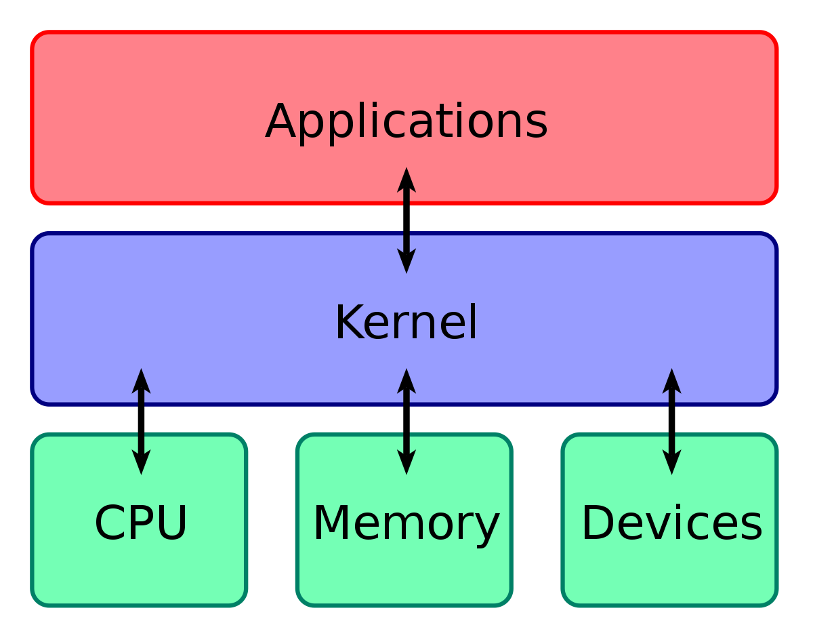

>시스템 호출 (System Call) 이란 무엇이며, 어떻게 동작하나요? 동기화와 데드락에 대해 설명해주세요.

# System Call

우선 해당 주제에 들어가기 앞서 간단한 키워드들에 대해 설명을 하고자 합니다.

운영체제는 사용자 인터페이스를 제공하는데 대표적으로 쉘이 있습니다. 

### 커널 (Kernel) 이란? 
커널은 운영체제 중 항상 메모리에 올라가 있는 운영체제의 핵심 부분으로써 하드웨어와 
응용 프로그램 사이에서 인터페이스를 제공하는 역할을 하며 컴퓨터 자원들을 관리하는 역할을 한다. 

커널은 다양한 자원을 관리하는데 이는 사용자가 물리적인 하드웨어에 접근하고 사용할 수 있도록 매개하기 위해서이다. 
즉, **인터페이스로써 사용자가 컴퓨터만의 언어와 규칙으로 하드웨어와 통신할 수 있도록 도와주는 역할**을 한다.

### 쉘 (Shell) 이란? 
Kernel 위에 붙어 있는 부가적인 프로그램들 중 대표적인 프로그램입니다.

운영체제(OS)는 가장 큰 역할 중 하나가 사용자로 하여금, 컴퓨터를 쓰게끔 만듭니다.  
컴퓨터를 쓰게 하려면 사용자가 어떻게 써야 하는지 사용법을 알려줘야 하는데, 그 사용법을 알려주는 프로그램이 바로 쉘입니다.

즉, 사용자가 운영체제 기능과 서비스를 조작할 수 있도록 인터페이스를 제공하는 프로그램입니다. 
쉘은 터미널 환경(CLI)과 GUI 환경(마우스...) 두 종류로 분류합니다.  
유명한 쉘로는 Linux, Bash가 있습니다.

## System Call ?

사용자는 쉘에게 명령 -> 쉘은 커널에게 명령 -> 커널은 쉘에게 다시 Return -> 쉘은 사용자에게 다시 Return

그럼 어떻게 쉘과 커널은 서로 의사소통을 하고 있는 것일까요?  
둘 다 코드로 만들어져 있기 때문에 커널은 쉘 프로그램이 요청할 수 있도록 인터페이스를 제공합니다.

이를 `시스템 콜(System Call)`이라 합니다.

보통... OS는 C언어 혹은 C++로 구현이 많이 되어 있습니다. 그래서 C나 C++의 함수로 호출할 수 있는 것이 많습니다.

그렇다면, Java에서 C언어 or C++ 등.. 구현되어 있는 시스템 콜을 어떻게 호출할 수 있을까요? 
Java 코드를 작성하려 하면 맨 처음에 하는 일은 무엇인가요 ? 바로 `JDK 설치`입니다.

그 JDK Program이 자신이 작성한 Java 프로그램을 실행할 때 System Call을 처리하는 것을 자동으로 호출해 주는 것입니다.

그리고 항상 응용 프로그램은 커널에게 요청합니다. 응용 프로그램은 직접 가서 처리할 수 없게 되어 있습니다. 
즉, **함부로 응용 프로그램이 전체 컴퓨터 시스템을 해치지 못한다는 말**과 같습니다. 

위의 설명과 같은 말로 Kernel에 관련된 것들은 `커널모드`로 전환후에 해당 관련된 작업을 수행할 권한이 생깁니다.

### 정리

- OS는 System Call을 제공합니다.
- 프로그래밍 언어별 OS 지원을 위해 OS 별 API 제공합니다.
- 응용 프로그램 개발 시 OS 기능이 필요한 경우 해당 API를 사용해 프로그램 작성합니다.
- 응용 프로그램 실행 시 해당 API를 호출하면, 커널 모드로 변경 후 OS 내부에서 해당 명령이 실행되고 응용 프로그램에 결과를 Return합니다.

# 동기화와 교착상태 (Dead Lock)

### 동기화
동기화(Synchronization)는 여러 개의 동시 실행되는 스레드 또는 프로세스 간에 실행 순서나 상태를 조정하여 원하는 결과를 얻는 것을 말합니다.
동기화는 **공유 자원에 대한 접근을 조절하거나 스레드/프로세스 간의 상호작용을 제어하는 메커니즘을 사용하여 상호 간섭이나 경쟁 조건(Race Condition)을 방지하고 일관된 실행을 보장**합니다.
동기화는 임계 영역(Critical Section), 뮤텍스(Mutex), 세마포어(Semaphore), 조건 변수(Condition Variable) 등의 동기화 기법을 사용하여 구현될 수 있습니다.

추가로 공부할 것은 임계 영역, 뮤텍스, 세마포어, 조건 변수 등이 있습니다.

교착상태(Deadlock)는 여러 개의 작업이 서로 상호 의존하며, 각 작업이 서로가 필요한 자원을 가지고 있는 상태에서 발생할 수 있는 상황입니다. 
교착상태는 다음 네 가지 조건을 동시에 충족할 때 발생합니다: 상호 배제(Mutual Exclusion), 점유 대기(Hold and Wait), 비선점(No Preemption), 순환 대기(Circular Wait). 
교착상태가 발생하면 프로그램은 진행이 멈추고 더 이상 진행할 수 없는 상태가 됩니다. 
교착상태는 잘못된 동기화, 자원 관리 오류, 프로세스 스케줄링 등의 이유로 발생할 수 있습니다. 
교착상태를 해결하기 위해서는 교착상태의 조건 중 하나를 제거하거나 교착 상태를 탐지하고 복구할 수 있는 알고리즘을 사용해야 합니다.

### 정리
요약하자면
- 동기화는 여러 개의 스레드/프로세스 간에 실행 순서와 상태를 조정하여 상호 간섭과 경쟁 조건을 방지하고 일관성을 유지하는 메커니즘이며, 
- 교착상태는 작업들이 자원을 서로 대기하며 진행이 멈추고 더 이상 진행할 수 없는 상태를 말합니다.