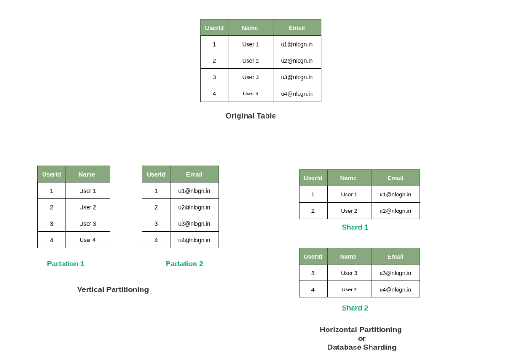
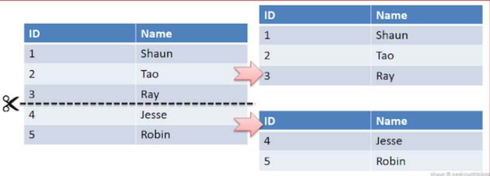
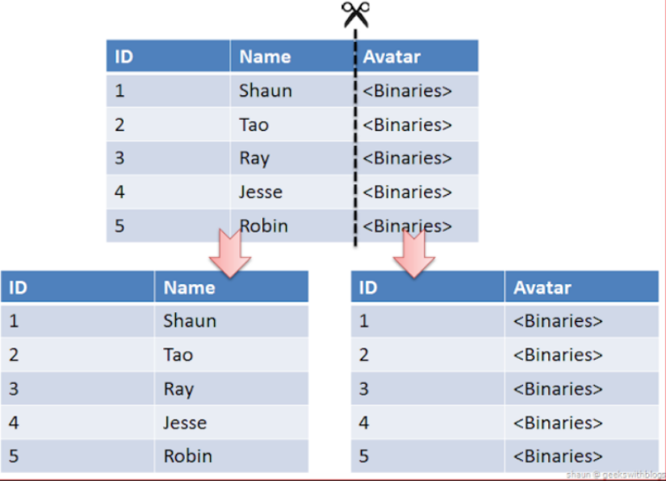
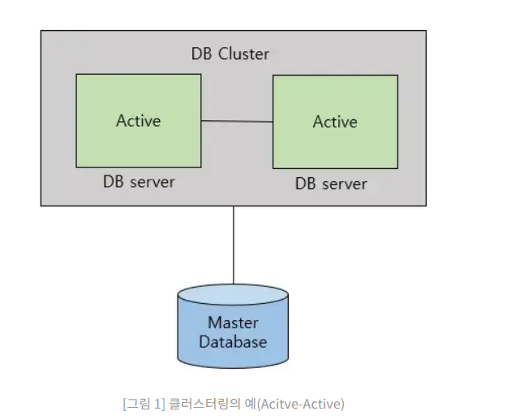
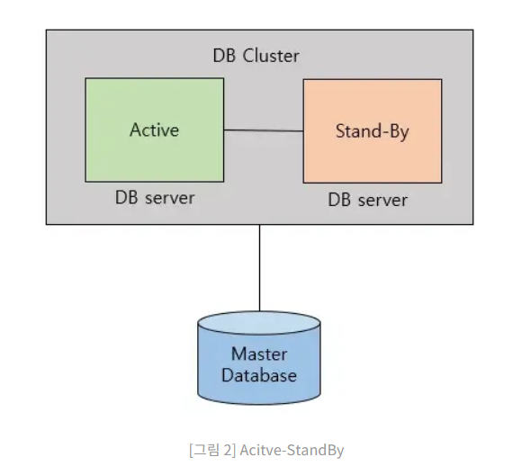
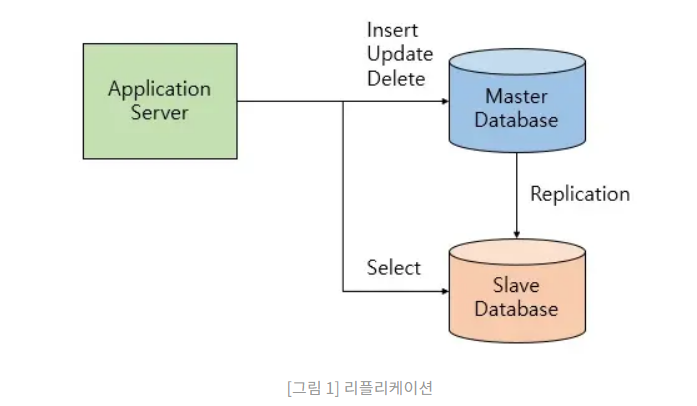

# 파티셔닝 vs 샤딩

## 샤딩 

- 목적
  샤딩은 각 DB 서버에서 데이터를 분할하여 저장하는 방식이다. 
- 해당 데이터에 접근할 때는 샤딩키를 사용하여 동적으로 DB 서버를 매핑하는 과정이 필요하다.

-> 성능을 위해 균일하게 저장해야한다. 

- 샤딩과 수평적 파티셔닝 차이

 수평적 파티셔닝은 동일한 DB 서버 내에서 테이블을 분할하는 것이고 샤딩은 DB 서버를 분할한다는 것이다. 
 즉, DB 서버의 부하를 분산할 수 있다.

- 장점
  - 샤딩 데이터베이스의 탐색 범위 단축으로 응답 시간 개선
  - 샤드 단위의 데이터베이스 장애로 전체 서비스 중단 방지 가능
  - 데이터베이스 용량 확장 용이 

샤딩은 실제 구현이 복잡하다. 
잘못 수행하면 데이터가 손실되거나 테이블이 손상되거나 부하의 불균형 등이 발생할 수 있다. 
이를 샤딩 전 원래 DB 구조로 되돌리는 작업은 매우 복잡하고 어렵다.
그러므로 샤딩은 파티셔닝(Partitioning)이나 복제(Replication)보다 신중하게 결정해야 한다.

## 수평적 파티셔닝 

- 분산저장 시 하나의 테이블을 row 기준으로 나눠서 저장하는 방식
- 데이터의 개수가 작아지면서 index의 갯수도 작아지게 된다. 
- 읽기과정에서 latency가 증가하게 된다. 
- 파티션 하나가 고장나도 데이터 무결성이 깨진다. 

## 수직적 파티셔닝 
- 분산저장 시 하나의 테이블을 column 기준으로 나눠서 저장하는 방식
- 자주사용하는 column을 분리시켜 성능을 향상 시킬 수 있다. 

# 클러스터링 VS 리플리케이션 

## 클러스터링 

동일한 데이터베이스를 여러 대의 서버가 관리하도록 클러스터를 구축하는 것을 뜻한다.

- 방식 
  - active- active 방식 
  - active-standBy 방식
  

- 장점
    - 모든 DB가 Active 상태면 하나의 서버에 이상이 생기더라도 바로 다른 서버를 
이용해 정상적인 서비스 운영이 가능하다.
    - 클러스터링을 이용하면 기존에 하나의 서버에 몰리던 부하를 여러 곳으로 분산시킬수 있다. 
로드밸런싱이 가능해진다.
- 단점 
여러대 의 서버가 데이터베이스를 공유하므로 병목현상이 발생해 더 많은 비용이 발생할 수 있다. 
  -> 이를 완화시킨게 Active - StandBy 방식이다.

Active-StandBy 방식은 Active 서버와 StandBy 서버를 나누어 운영한다.
- 장점 
Active 서버에 문제가 발생했을 경우 Active 상태로 전환되어 사용된다. 
-> 병목 현상을 해결할 수 있다. 

- 단점
하지만 장애 발생시 standBy 상태에서 Active 상태로 전환하는 시간동안 서비스를 사용할 수 없다는 단점도 존재한다.

Active-Active는 부하 분산의 장점이 있지만 Active- standBy는 효율이 줄어드는 단점이 있다. 

클러스터링 방식 -> db서버 장애를 Fail-Over 하는 방식

## 리플리케이션 방식

리플리케이션이란 여러 개의 DB를 권한에 따라 수직적인 구조(Master-Slave)로 구축하는 방식이다. 
Master Node는 쓰기 작업 만을 처리하며 Slave Node는 읽기 작업 만을 처리한다. 
리플리케이션은  Master와 Slave간의 데이터 무결성 검사(데이터가 일치하는지)를 하지 않는 비동기 방식으로 노드들 간의 데이터를 동기화한다.

- 장점
  - DB 요청의 60~80% 정도가 읽기 작업이기 때문에 Replication만으로도 충분히 성능을 높일 수 있다.
    비동기 방식으로 운영되어 지연 시간이 거의 없다.
- 단점
  - 노드들 간의 데이터 동기화가 보장되지 않아 일관성있는 데이터를 얻지 못할 수 있다.
    Master 노드가 다운되면 복구 및 대처가 까다롭다.